# Assignment 6: Skinning & Skeletal Animation

Name: 'Di Zhuang'

Legi-Nr: '21958772'


## Required results
Edit this 'README.md' file to report all your results. Use the ```/res``` folder to store your results.

### Tasks

1. Read Sec. 1 carefully to get familar with the data format, problem formulation, and mathematical background.
2. (Task 2) two theoretical discussions 
3. (Task 3) visualize the animation of the input skeleton of the hand shape from two types of rotations (rotation matrices and quaternions)
4. (Task 4) compute harmonic skinning weights on selected handles
5. (Task 5) per-vertex LBS + rotation/translation + Lerp
6. (Task 6) per-vertex LBS + dual quaternion + Nlerp
7. (Task 7) per-face LBS + quaternion + Slerp + Poisson Stitching
8. (Task 8.1) context-aware per-vertex LBS
9. (optional Task 8.2) context-aware per-face LBS
 
### Important Note
1. We do not provide template code for this assignment - feel free to use previous template code if you want
2. You can use any libigl functions (and other open-source code, but please add a reference in this case)
3. You are allowed to use your previous code (for example, you will find the Poisson Stitching technqiue quite similar to Deformation Transfer that you have implemented in Assignment 5; and also the provided handle selection in A5 might inspire you to design your handle selection tool in Task 4).
4. You are allowed to modify this report freely (but please try to stick to some table format of orangizing figures to avoid a 20-page long report)
5. Please feel free to try other skeletal animation/deformation data you can find online if you find the provided animation is not cool enough (for example [here](https://www.mixamo.com/#/), but note that they might be in different data format than the provide ones).
6. Please try to keep your code clean and self-explained (with necessary comments), since we will grade this assignment based on your code as well (~~please don't feel upset when you get bad animations, you can always blame our poor data preparation~~).

## Instruction
### Hand
1. press 'H' to load data and do precomputation
2. press 'S' to view selected handles / press 'R' to view reference handles / press 'W' to view weighting function
3. press 'E' then ' ' to view skeleton animation
4. press 'V' then ' ' to view mesh animation based on per-vertex LBS
5. press 'D' then ' ' to view mesh animation based on dual quaternion skinning
6. press 'P' then ' ' to view mesh animation based on per-face LBS
### Context-aware
1. press 'B' to load data and do precomputation
2. press 'V' then ' ' to view mesh animation based on per-vertex LBS
3. press 'Q' then ' ' to view mesh animation based on per-vertex context-aware LBS
## Reports

### Task 2: Rotation Representation discussion
#### Task 2.1. compare different rotation representations
**Reference 1**: F. Sebastian Grassia. Practical parameterization of rotations using the exponential map. Journal of Graphics Tools, 3(3):29–48, 1998.
**Reference 2**: Ben Kenwright. A beginners guide to dual-quaternions: what they are, how they work, and how to use them for 3d character hierarchies. 2012.
| Representions        |  Short Description  |     pros            |      cons           |
| :------------------: |:------------------: |:------------------: |:------------------: |
| rotation matrix      | Each rotation can be represented as a 3x3 matrix whose columns are of unit length and are mutually orthogonal, and whose determinant is 1.0. The set of all such matrices forms the group SO(3) under the operation of matrix multiplication, and each member of the group in turn corresponds to a rotation.            | A great many algorithms have been formulated and tested with matrices and so people choose them instinctively first.                |  Firstly, they take a minimum of 12 parameters to represent a structure with only six DOF; if memory is at a premium this can be undesirable. Secondly, the rotational part of the matrix is composed of orthogonal columns which can drift and introduce unwanted scaling and sheering. Thirdly, interpolating between matrices is difficult. The three columns forming the orthogonal axis directions in the rotation part of the matrix do not represent the vector space and cannot be interpolated. Finally, it is difficult to visualize a matrix and the axis-angle component about which it will rotate and translate.           |
| euler angles         | An Euler angle is a DOF that represents a rotation about one of the coordinate axes. There are three distinct functions Rx , Ry , and Rz for computing rotation matrices, depending on the coordinate axis about which the Euler angle rotates. These functions involve the sine and cosine of the Euler angle. In practice, the angles are used by inserting them into matrices. The product of the three angle-matrices produces the Euler angle set. For example, the factorization XYZ, would mean rotate around X then Y then Z.              |They are very intuitive and have a long history in physics and graphics and can make certain integrals over rotational space easier. They are minimalistic and require only three parameters. Furthermore, since the angles are used directly, there is no drifting or the need for normalization. Euler angles provide an easy to use interface to animators in the form of three independent sliders (or the equivalent), and also work quite well in all applications requiring one or two DOF rotations. Suitable for integrating ODEs.              | Euler angles suffer from singularities - angles will instantaneously change by up to 2$\pi$ radians as other angles go through the singularity; Euler angles are virtually impossible to use for sequential rotations, they do not commute under composition. Three DOF Euler rotations, formed by concatenating three single-axis rotations, suffer from gimbal lock when two of the three rotation axes align, causing a rotational DOF to be lost. Interpolation of Euler angles results in poor interpolation of rotations, since Euler angles interpolate about each of the three axes independently, ignoring the interaction between the axes that arises from rotations’ non-Euclidean nature.             |
| quaternions           | Quaternions form a group whose underlying set is the four dimensional vector space R4 , with a multiplication operator ‘o’ that combines both the dot product and cross product of vectors [9]. The set of unit-length quaternions is a sub-group whose underlying set is named $S^3$. Quaternions are of interest to graphicists, roboticists, and mechanical engineers primarily because we can use $S^3$ to describe and carry out rotations.              |Rotation of a vector can be performed by quaternion multiplication. There are simple formulae for computing a rotation matrix and its partial derivatives from a unit quaternion. The four partial derivatives exist and are linearly independent over all of $S^3$, which means that unit quaternions are free from gimbal lock when used to control orientations. $S^3$ is an excellent place to interpolate rotations because it possesses the same local geometry and topology as SO(3).               | Since there are four directions in which a quaternion can change, but only three rotational DOFs, an optimizer or differential control algorithm is free to move the quaternion off the unit quaternion sphere, leading to non-rotations. It can incur an overhead in efficiency and/or code complexity whenever derivatives are used for control or optimization.              |
| axis angle          | The axis angle maps a vector in R3 describing the axis and magnitude of a three DOF rotation to the corresponding rotation.              |It directly represents the action of rotation, while being straightforward and intuitive to work with.               | It is difficult to combine the axis-angle elements in their native form; usually being converted to an alternative representation for concatenation. Axis-angle interpolation cannot be done using linear interpolation of the four elements. Interpolating between the four elements naively in this way does not give the shortest path.              |

#### Task 2.2. Theoretical question for dual quaternions

| Euler angles -> rotation  matrix |  rotation matrix -> quaternion  |    quaternion + translation -> dual quaternion   |
| :------------------------------: |:------------------------------: |:-----------------------------------------------: |
| [solution](./res/task_2_2.pdf)                            | [solution](./res/task_2_2.pdf)                        |[solution](./res/task_2_2.pdf)                                            | 

### Task 3: animation of the skeleton
| from rotaton matrix  |  from quaternions   |
| :------------------: |:------------------: |
| 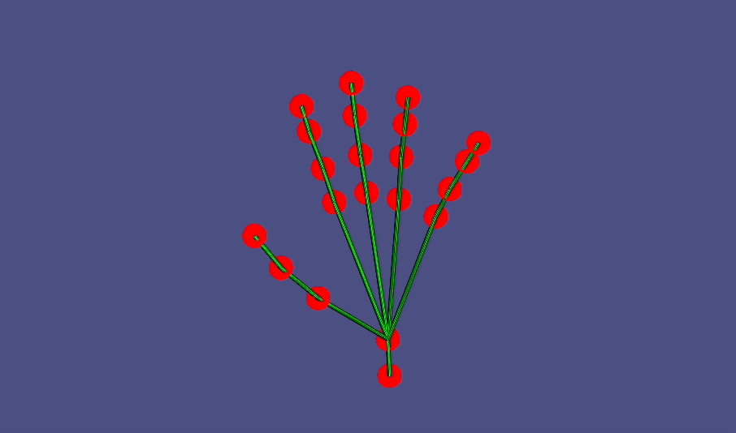  |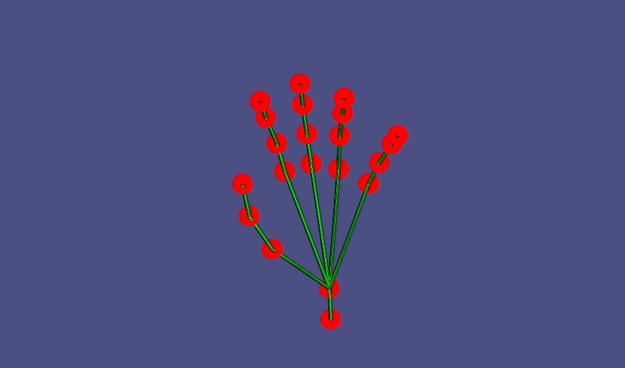  |

### Task 4: computing harmonic skinning weights on selected handles
#### Task 4.1. handle selection
| shape name           |  joint 1            |  joint 2            |  joint 3            |
| :------------------: |:------------------: |:------------------: |:------------------: |
| hand | 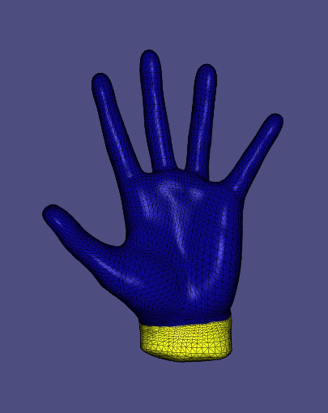  | 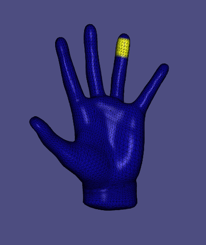 | 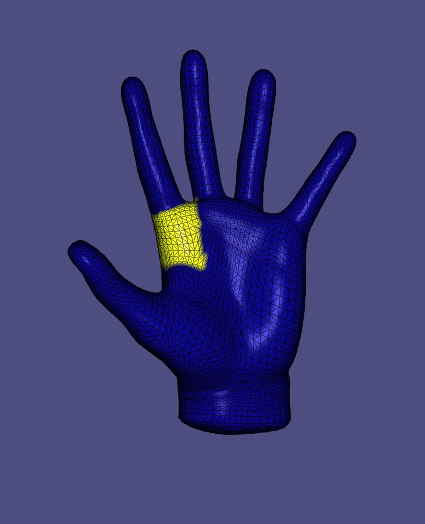 |


#### Task 4.2. skinning weights visualization
| shape name           |  joint 1            |  joint 2            |  joint 3            |
| :------------------: |:------------------: |:------------------: |:------------------: |
| hand | 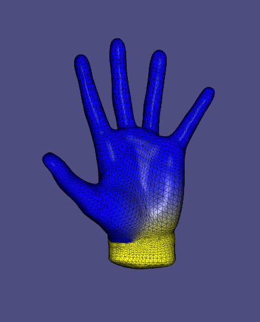  | 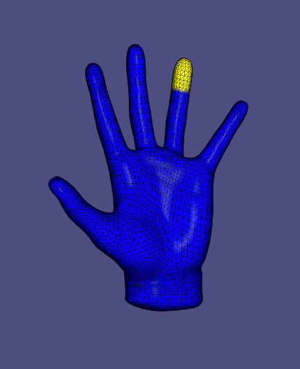 | 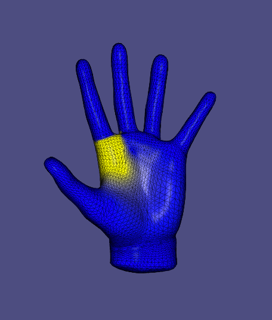 |

### Task 5/6/7: skeletal animation 
| Task 5: per-vertex + rotation + Lerp   | Task 6: per-vertex + quaternion + Nlerp      | Task 7: per-face + quaternion + Slerp  |
| :---------:                            |        :---------:                           |       :---------:                      |
|  |  |    |


Your comments (how these setups different from each other, and please compare the visual effects)
| Task 5: per-vertex + rotation + Lerp   | Task 6: per-vertex + quaternion + Nlerp      | Task 7: per-face + quaternion + Slerp  |
| :---------:                            |        :---------:                           |       :---------:                      |
| This setup uses per-vertex weighting function, and rotation matrices as input. In addition, it uses Lerp to interpolate the rotation matrices for the frames, which is to linearly interpolate the matrices in the chosen rotation space. It can be seen that the resulting animation gets artifacts between the bone edges (e.g. the mesh at the joints or between two bone edges is squeezed).           | This setup uses per-vertex weighting function, and rotation quaternions of the first and the last frame as input. It uses Nlerp to interpolate the intermediate quaternions, which maps the result of Lerp to the space of unit quaternions (rotation space). Similar to the result of Task 5, the resulting animation gets artifacts between the bone edges (e.g. the mesh at the joints or between two bone edges is squeezed).             |This setup uses per-face weighting function, and rotation quaternions of the first and the last frame as input. However, it uses Slerp to interpolate the angles of rotations. Therefore, Slerp is independent of rotation representation. In the resulting animation, the articats between bone edges disappear due to per-face method, but there are two fingers having unnatural movement. The reason is that per-face method could produce disconnected mesh and poisson stitching is used to connect the meshes based on face transformation gradient, which could lead to weird behaviour around the moving joints.           |


### Task 8.1: context-aware per-vertex LBS
#### Task 8.1.1 visualize the unposed example shapes
| shape name           |  pose 1             |   pose 2            |   pose 3            |
| :------------------: |:------------------: |:------------------: |:------------------: |
| human | 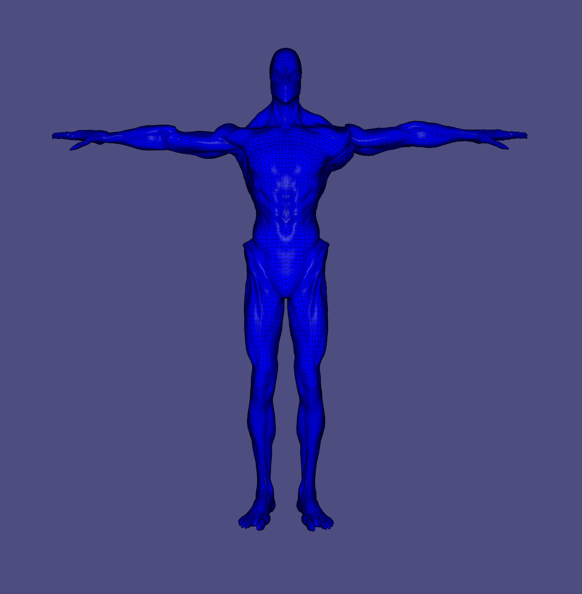  | 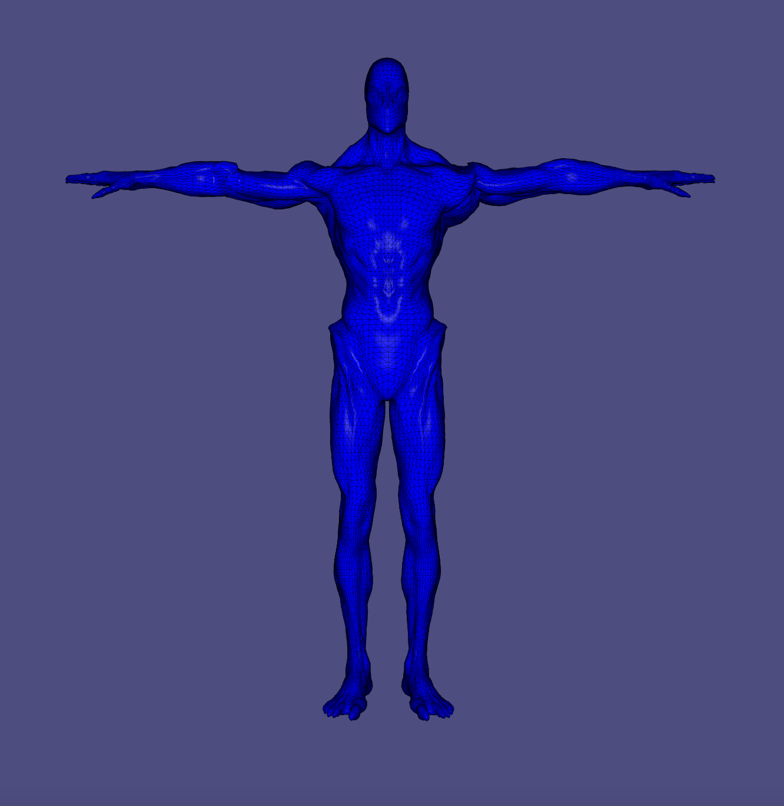 | 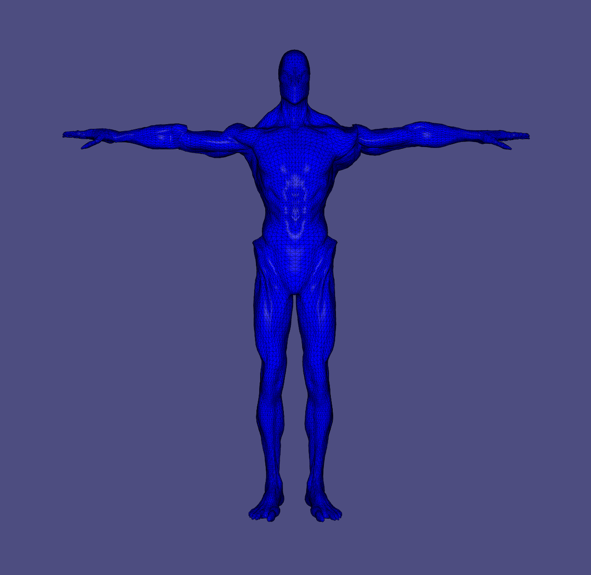 |

#### Task 8.1.2 skeletal animition using context
| without context   | with context     | 
| :---------:                            |        :---------:                           |  
|  |  |  